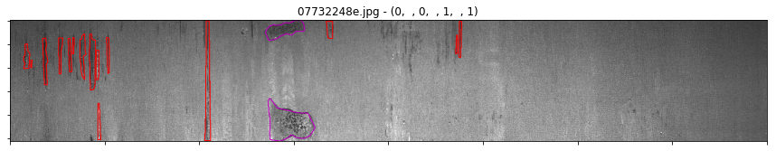
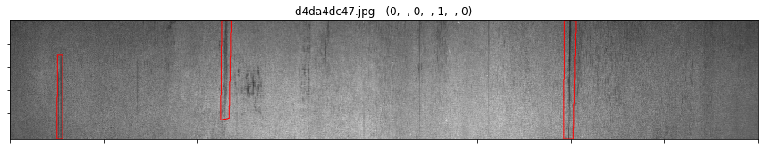
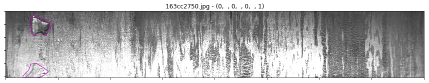
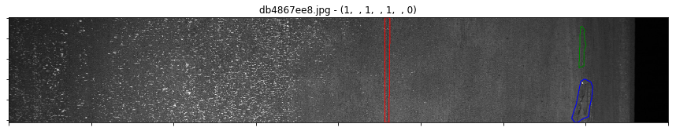
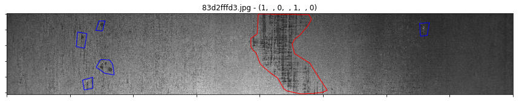
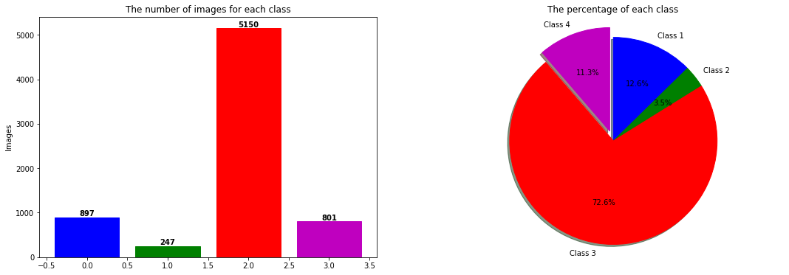
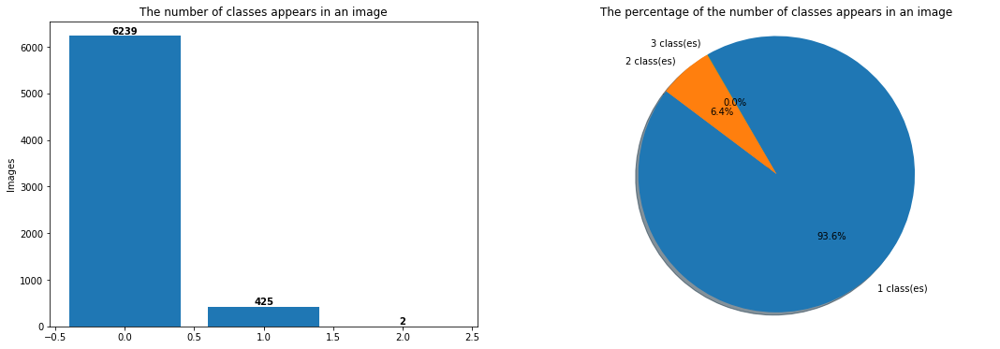
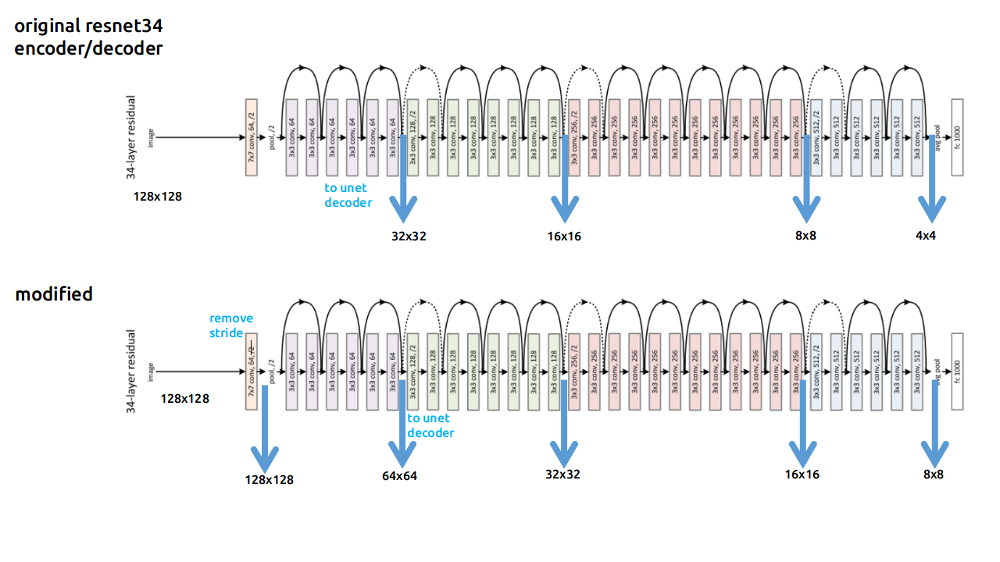
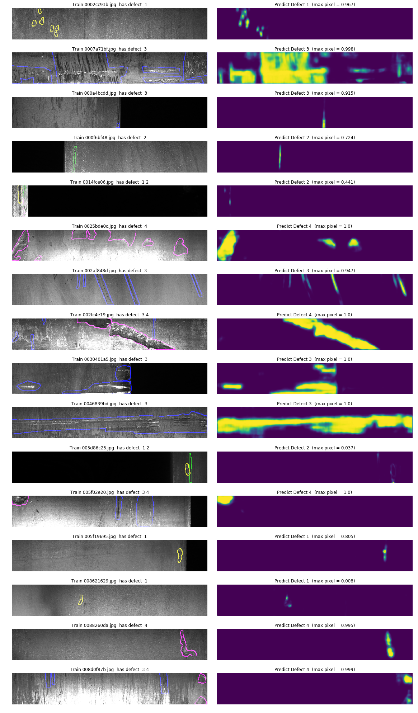

# Detecting Defects in Steel Manufacturing Line using Computer Vision

## This is my attempt at the Severstal Kaggle competition for deteSeverstal

Here is a description of the competition/objective:
-----
==> **In this competition, you’ll help engineers improve the algorithm by localizing and classifying surface defects on a steel sheet.**

- We'll be using images from high frequency cameras to power a defect detection algorithm.
- Each image may have no defects, a defect of a single class, or defects of multiple classes. For each image you must segment defects of each class (ClassId = [1, 2, 3, 4]).
- The segment for each defect class will be encoded into a single row

## Here are samples of the different kinds of defects (each combination from the training set is represented here)

## Here is the distribution of different classes within the dataset

## Model Summary

I will be using [segmentation-model](https://github.com/qubvel/segmentation_models#models-and-backbones) package to load pretrained weights.

I will be using the basic Unet architecture with a resnet backbone, which has pre-trained weights for faster and better convergence.
- Note: The resnet backbone here means that resnet model weights will be used as the encoder part (the first half) of the UNet, and from which the decoder part (the second half) will be programmatically built up. The idea is to enable use of a proven image classification architecture with pre-trained weights for transfer learning benefits.

So in essence, the encoder portion of the standard UNET is replaced with resnet34, and the decoder portion is appropriately inferred based on the resnet34 architecture (i.e. decoder/upsampling is adjusted so that output=input).

## Predictions

## Error Analysis

UNET outputs masks using all floating point values between 0 and 1 inclusive. When we submit to Kaggle, we need to use only integer 0 and 1. Therefore we must convert mask floating points into integers using a threshold. If pixel>=THRESHOLD then pixel=1 else pixel=0. We will plot histograms for various thresholds below. We will consider all masks with less than 250 pixels as empty masks (where pixel_count = 4 * pixel count on 128x800).

From the plots below, we see that UNET doesn't create more and/or larger masks for images with defects. UNET seems to equally create masks for all images whether there is a defect or not. 
